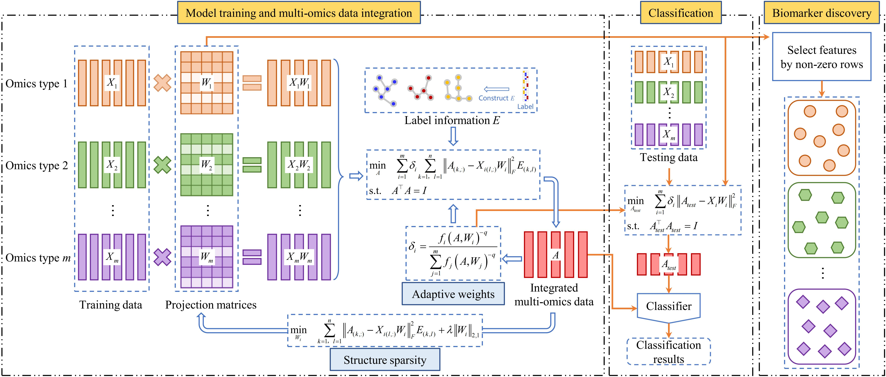

# Supervised Generalized Canonical Correlation Analysis via Embedding Adaptive Weight and Structural Sparse for Multi-Omics Data Integration
This repository provides a demo for the multi-omics integration model SASCCA.

Computer Environment :
-
- MATLAB R2023a (requires Parallel Computing Toolbox installed).
- If your working environment cannot enable parallel pooling, please replace *parfor* with *for*.
- The svm toolkit (https://www.csie.ntu.edu.tw/~cjlin/libsvm/#matlab) is needed if you use the svm classifier.

File:
-
- UCEC, STAD, and LGG: three publicly available cancer datasets.
- Appendix: Attachment to a paper.
- demo.m: run the example.
- measure.m: A function used to measure classification performance.
- rand_idx.mat: A customizable matrix that can be used to divide testing and training.

Please write to [zpliu@sdu.edu.cn](mailto:zpliu@sdu.edu.cn) if you have any questions.
